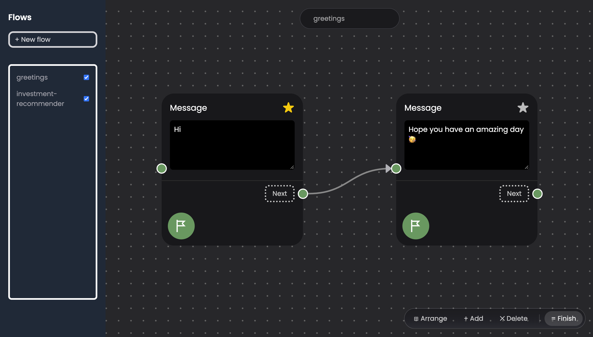

## Boteny

- Build conversational workflows visually with deterministic flows. Use AI where AI helps.

Boteny is a lightweight, self-hosted visual engine for building deterministic conversational workflows. Design conversations visually, mix predictable flows with AI, and deploy them across channels such as Telegram.

---


_Flow Page_

## Hosting

Boteny is self-hosted and can be run locally or deployed to your own server.

### Docker

```bash
git clone https://github.com/Swaymaw/Boteny.git
cd Boteny
docker compose -f docker-compose.dev.yml up -d --build
```

Once the containers are running, open the frontend at:

```text
http://localhost:3000
```

See the deployment configuration and environment variables in the repository for production setup.
